

  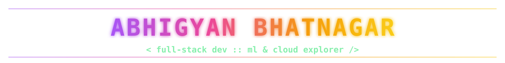

  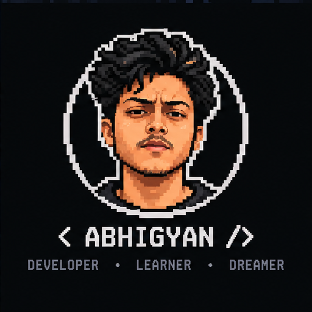
  &nbsp;&nbsp;&nbsp;
  

  

 

<!-- ====================================================== -->
<!-- ABOUT                                                  -->
<!-- ====================================================== -->

  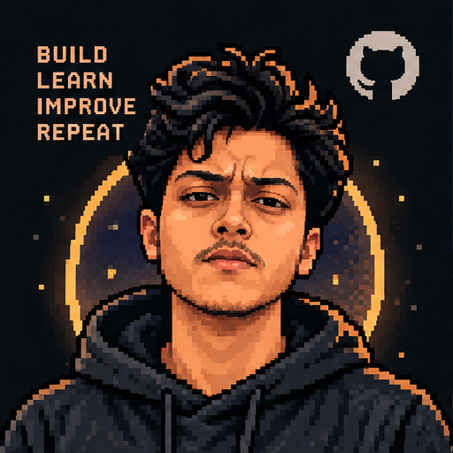
  &nbsp;&nbsp;&nbsp;
  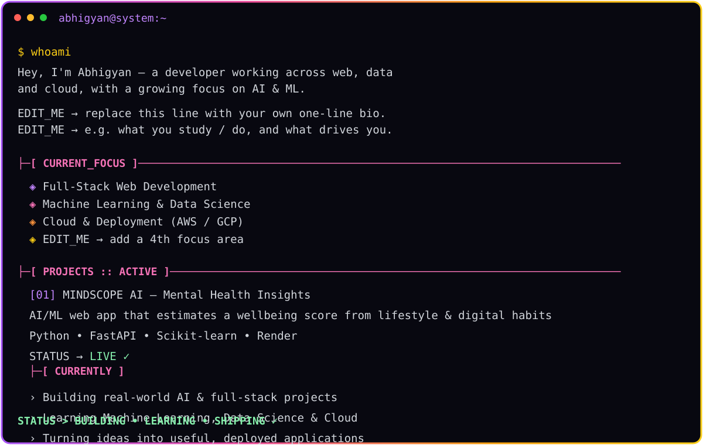

  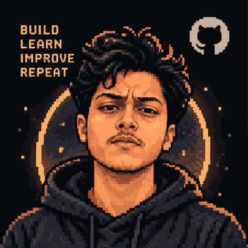

 

### `├─[ CURRENTLY ]────────────────────────────────────────────`

  
  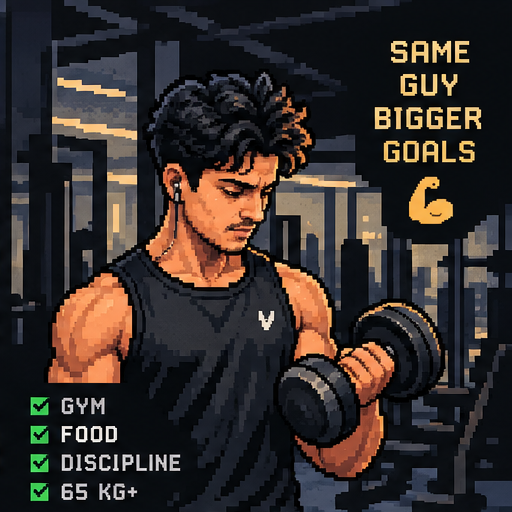
  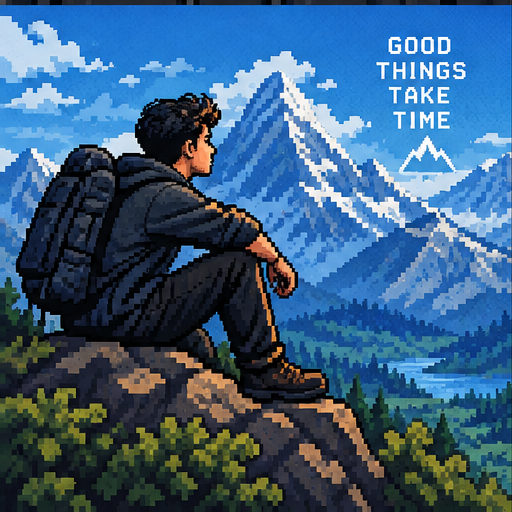
  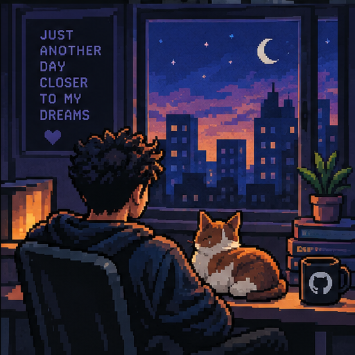

 

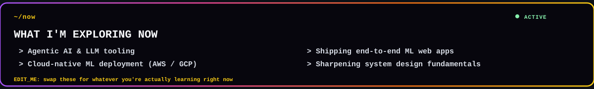

 

  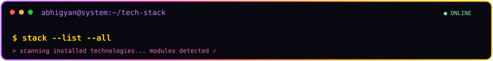

### `├─[ LANGUAGES ]────────────────────────────────────────────`

### `├─[ FRONTEND ]─────────────────────────────────────────────`

### `├─[ BACKEND_&_FRAMEWORKS ]────────────────────────────────`

### `├─[ DATABASES ]────────────────────────────────────────────`

### `├─[ AI_&_MACHINE_LEARNING ]────────────────────────────────`

### `└─[ DEVOPS_&_CLOUD ]───────────────────────────────────────`

  

<!-- ====================================================== -->
<!-- FEATURED PROJECTS                                      -->
<!-- ====================================================== -->

  

<a href="https://mental-health-score-1-6dlw.onrender.com/">
  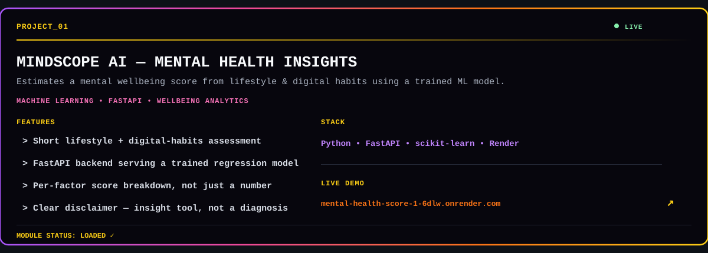
</a>

  

<a href="https://heart-disease-risk-predictor-ji32.onrender.com/">
  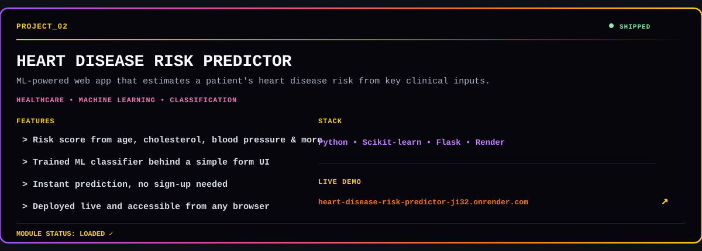
</a>

  

<a href="https://digit-recognition-system-twv0.onrender.com/">
  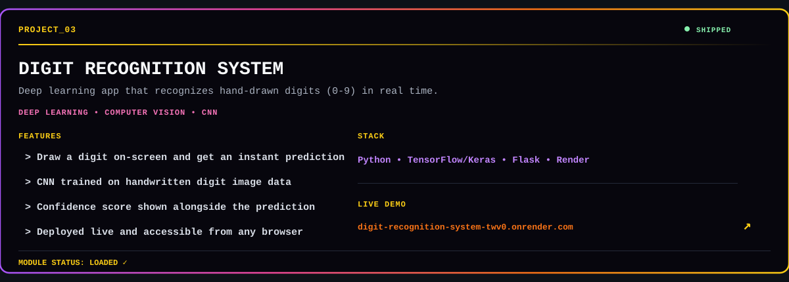
</a>

<!--
  Add more real projects the same way: duplicate assets/project-card-template.svg,
  fill in the EDIT_ME lines, save it under assets/, then:

  
-->

  

<h2 align="center">
  GITHUB
   TROPHIES
</h2>

  

  

 

 

 

  <picture>
    <source media="(prefers-color-scheme: dark)" srcset="https://raw.githubusercontent.com/abhix1504/abhix1504/output/github-contribution-grid-snake-dark.svg" />
    <source media="(prefers-color-scheme: light)" srcset="https://raw.githubusercontent.com/abhix1504/abhix1504/output/github-contribution-grid-snake.svg" />
    
  </picture>

### `├─[ RANDOM_DEV_QUOTE ]─────────────────────────────────────`

  

## 🤝 Let's Connect

---

---

  <code>$ echo "Code. Learn. Build. Repeat."</code>

  <code>STATUS: BUILDING...</code>

  Made with ❤️ and lots of debugging.

